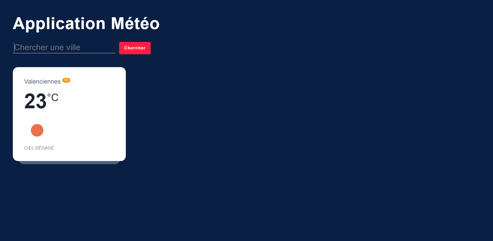

<h1 align="center">Application Météo</h1>

## Overview

  <h3>
    <a href="https://api-weather-tr.netlify.app/">
      Demo
    </a>
  </h3>

Ce projet a pour but de manipuler une API publique pour développer une appli météo en HTML, CSS et Vanilla JavaScript.
